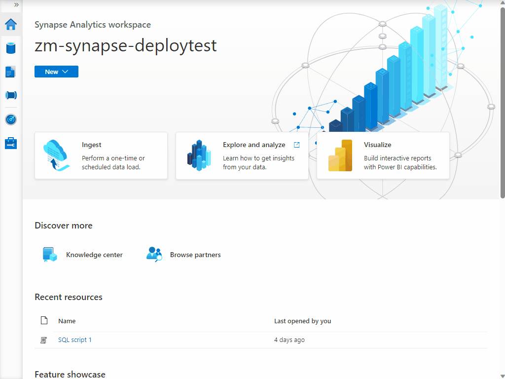
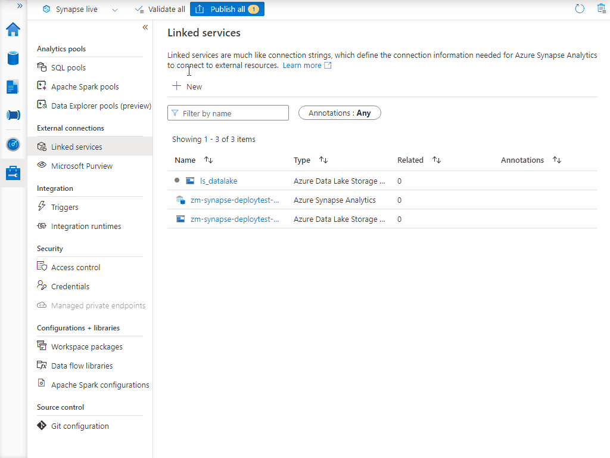
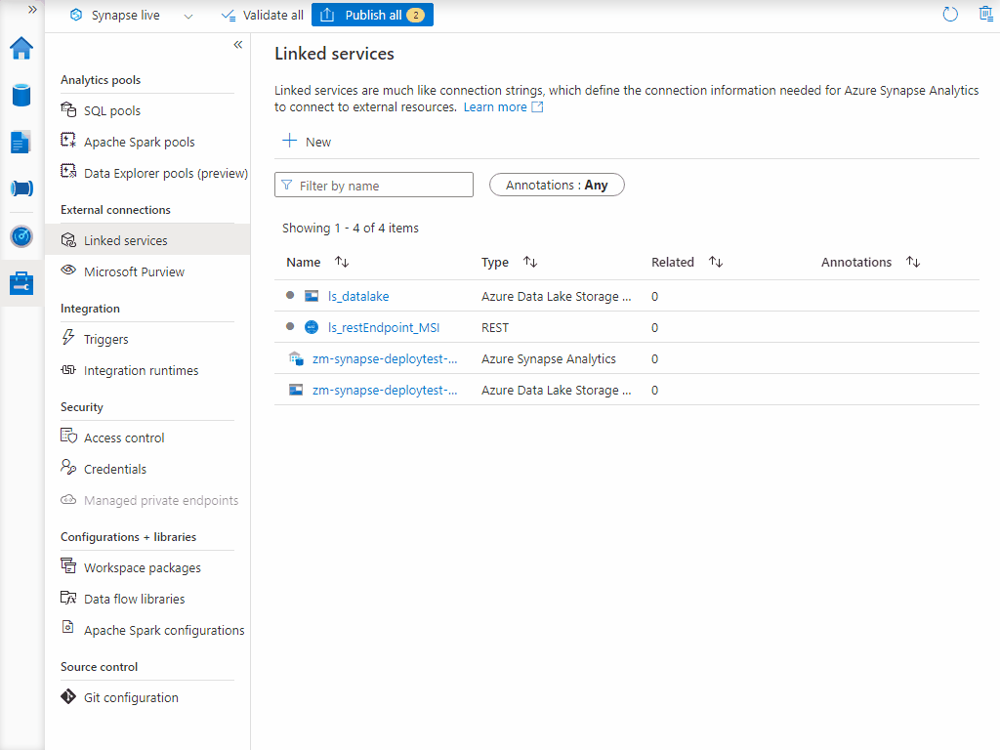

### Set Up Linked Services

1) Follow the process shown below to add Data Lake Linked Service by pasting the definition from the ls_datalake.json file contained in this repository. 

    

2) Follow the process from Step 1 but choose the REST Linked Service instead of Data Lake when going through the process and name the Linked Service ls_restEndpoint_MSI.

    

3) Publish the Linked Services.

    