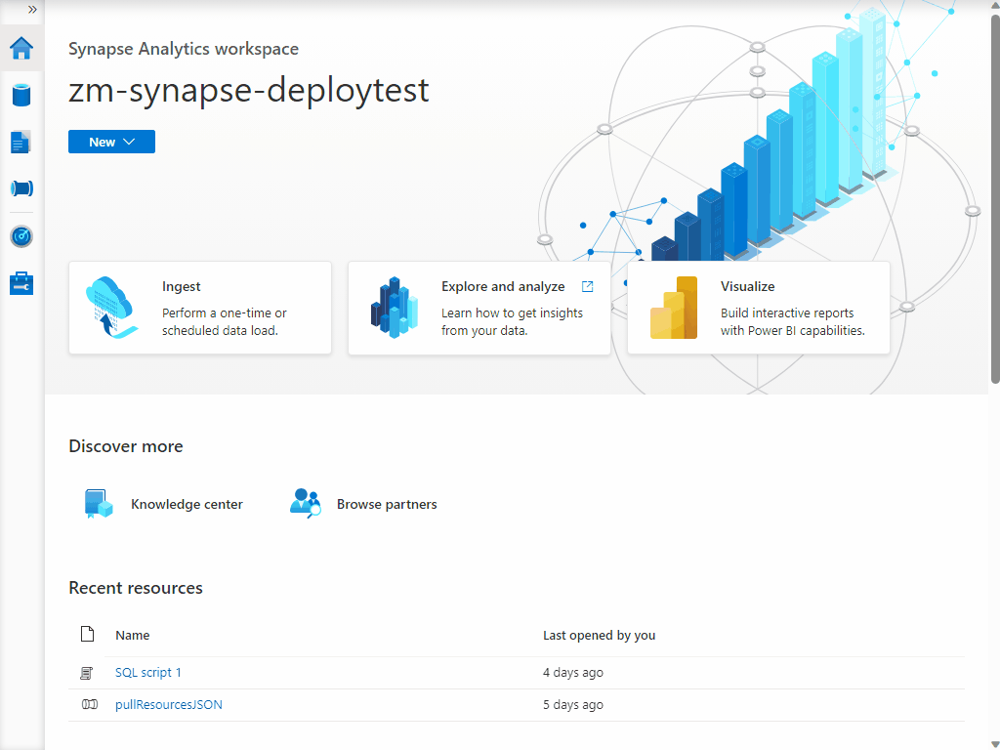

1) Import the pipeline template file [pullResourcesJSON.zip](../code/synapse/pipelines/pullResourcesJSON.zip) from this repository to your Synapse Workspace by following the guide below.

    

2) Publish imported Pipelines and Datasets to Synapse.

    