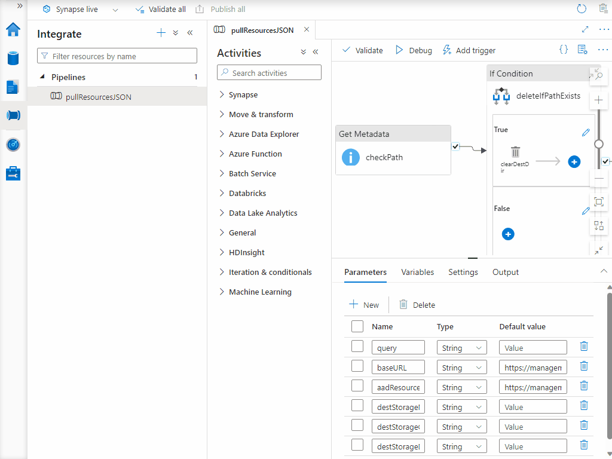

1) Test the pipeline by triggering it, setting the parameters, and observing its progress as outlined below.

    
    - <u>Parameter Explanation</u>
        - __query__ - Paste the contents of [exampleQuery.kql](../code/synapse/kql/exampleQuery.kql).
        - __destStorageName__ - The name of the Storage Account deployed with your Azure Synapse workspace
        - __destStorageContainerName__ - The name of the container created inside the Storage account deployed with your Azure Synapse workspace.
        - __destStorageDirectory__ - The path inside the Storage Account Container that will store the output files created by the Pipeline.
2) Check the status of the pipeline run to ensure succes.

    