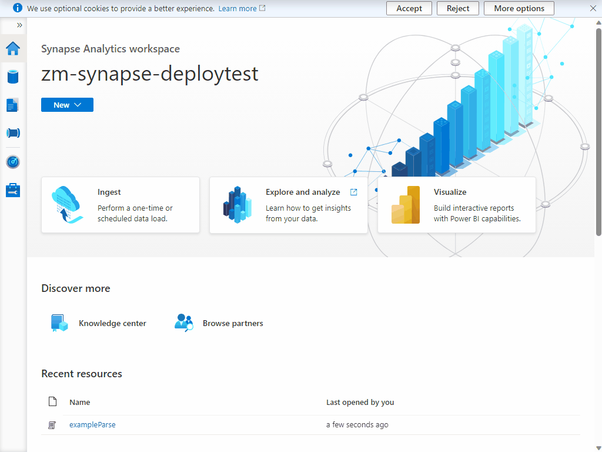

1) Import the [exampleParse.sql](..\code\synapse\sql\exampleParse.sql) SQL script in this repository.

    

2) Paste in the location of the json file created from the pipeline you created and ran in previous steps. (Note, if you have multiple JSON files use *.json instead of the filename.)

    

3) Run the query and ensure results are as intended.
4) If results are as intended and you would like to view them in a reporting tool, repeat step one using the [setUpDbAndView.sql](../code/synapse/sql/setUpDbAndView.sql) script. This will create a serverless database that can be used by Power BI and other reporting tools to visualize the data.