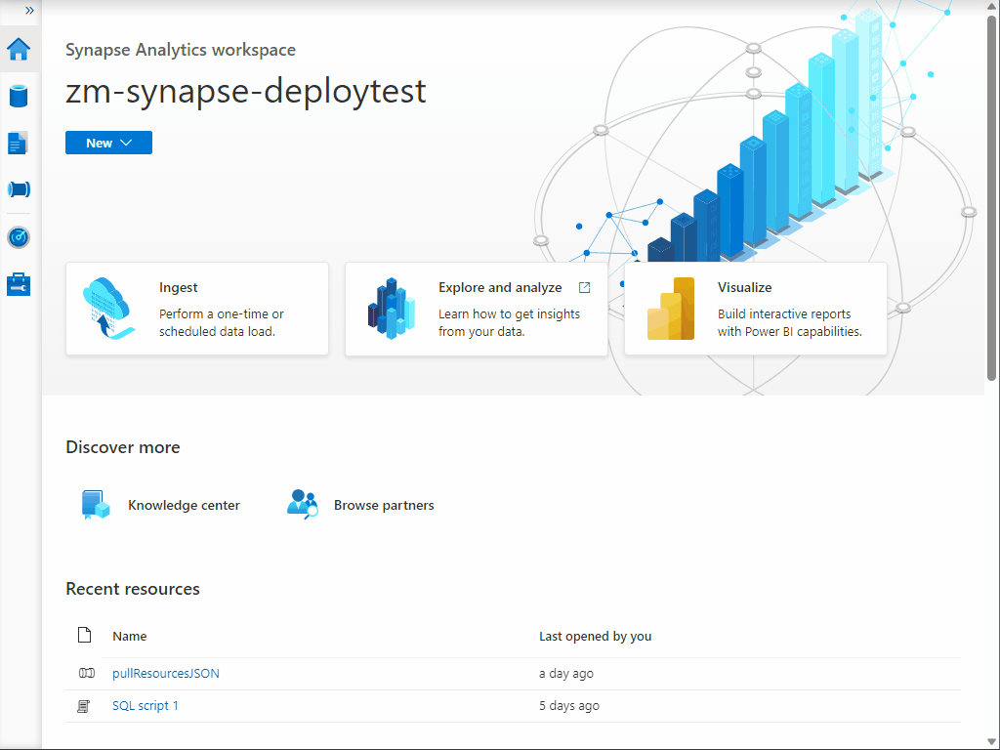

1) Import the [exampleParse.sql](..\code\synapse\sql\exampleParse.sql) SQL script in this repository.

    

2) Paste in the location of the json file created from the pipeline you created and ran in previous steps. (Note, if you have multiple JSON files use *.json instead of the filename.)

    

3) Run the query and ensure results are as intended.
4) If results are as intended and you would like to view them in a reporting tool, run the below to create a Database to store a view which will point to the data saved from Resource Graph.
    ```
    IF DB_ID('resourceGraphQueryResults') IS NULL 
    BEGIN
        CREATE DATABASE resourceGraphQueryResults
    END 

    /*Statement
    USE resourceGraphQueryResults
    ```